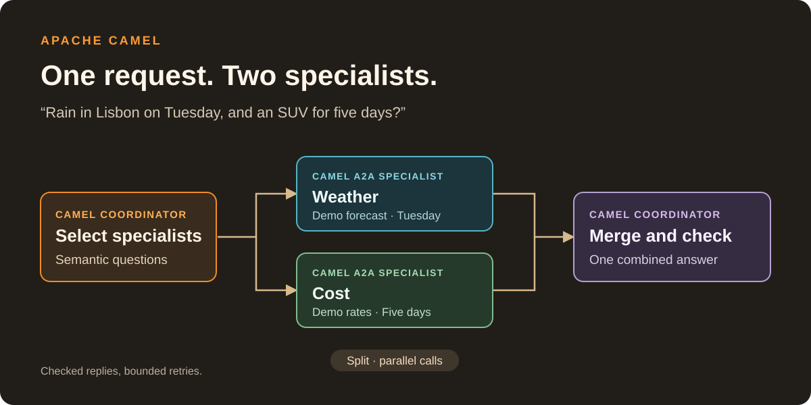
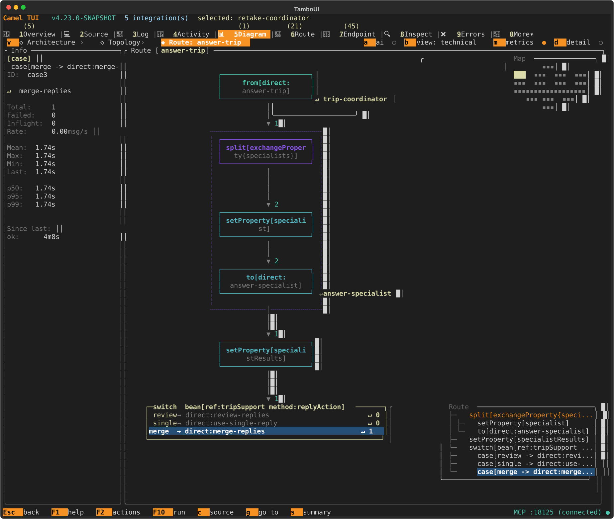
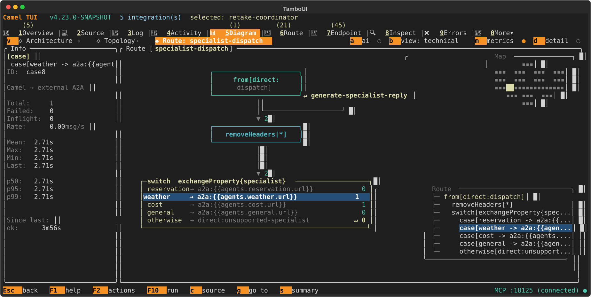
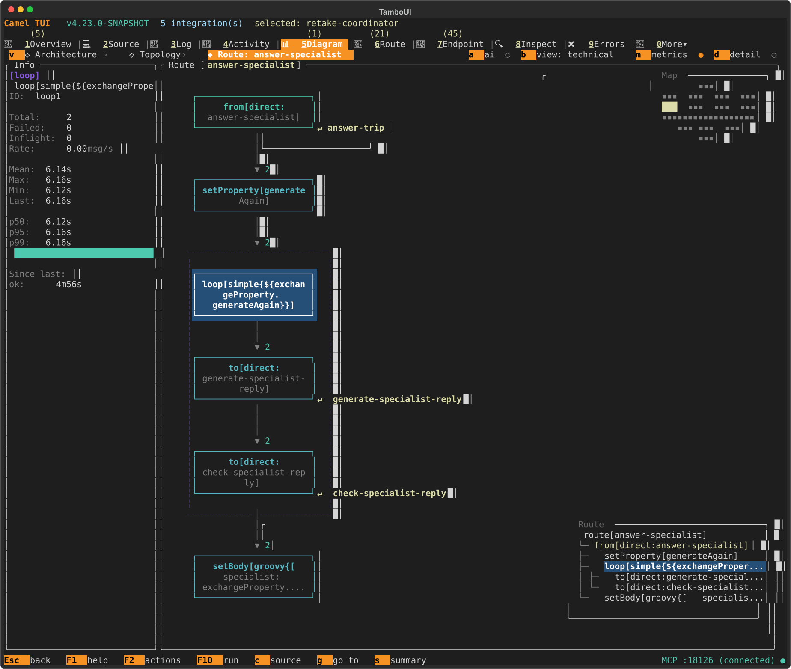

= Camel Example: Semantic Agent Routing
:toc:
:toc-title: On this page
:toclevels: 1
:sectanchors:

[.lead]
A *Camel coordinator* selects the specialists a request needs, calls them in parallel, and checks the combined answer.

One customer message can ask about weather, a reservation, and rental prices.
Camel asks independent semantic questions to select the required specialists,
calls their A2A endpoints in parallel, checks each contribution, and merges accepted
replies into one answer. A separate semantic question checks the merged answer for
completeness. A single-specialist request skips the merge.

Laya, Julia-1, or hosted Jev supplies the typed decisions; an OpenAI-compatible
chat model generates the specialist and merged replies. Use OpenAI or Gemini with
the same Camel routes.

.Conceptual flow for the Lisbon weather and SUV-price request

Only the specialists selected for this request are called. Each reply has a bounded
relevance-check loop before the coordinator combines accepted contributions.

.The request path
[cols="1,2,3",options="header"]
|===
|Step |Camel feature |Responsibility

|*1. Select*
|https://camel.apache.org/components/next/languages/semantic-language.html[`camel-semantic`]
|Ask three independent specialist-need questions and one fallback Choice in a single batch.

|*2. Fan out*
|https://camel.apache.org/components/next/eips/split-eip.html[Split EIP] + https://camel.apache.org/components/next/eips/switch-eip.html[Switch EIP]
|Split the selected specialist names, then dispatch each to a fixed destination in parallel.

|*3. Generate*
|https://camel.apache.org/components/next/a2a-component.html[`camel-a2a`] + https://camel.apache.org/components/next/openai-component.html[`camel-openai`]
|Each Camel specialist answers its part using its own prompt and demo facts.

|*4. Check each contribution*
|`camel-semantic` + Loop EIP
|Check relevance and retry clear rejections within a budget.

|*5. Combine*
|Split aggregation + `camel-openai`
|Collect the labelled replies. For multiple accepted contributions, generate one concise answer.

|*6. Check completeness*
|`camel-semantic` + Loop EIP
|Check that the combined answer covers every requested topic; retry only the merge if needed.
|===

Inspired by Kevin Dubois's
https://www.kevindubois.com/2026/09/23/routing-agents-with-jev-and-laya-adding-system-one-decisions-to-quarkus-langchain4j/[first agent-routing article]
and https://www.kevindubois.com/2026/10/01/routing-with-jev-and-langchain4j-agentic-part-2-the-real-api-multi-intent-requests-and-fan-out/[follow-up on multi-intent requests and fan-out].

== Requirements

* *Java 21+*
* *Maven* for the build and tests, or https://camel.apache.org/manual/camel-jbang.html[*Camel JBang*] to run the YAML directly.
* *A decision service*: choose one of the providers below.
* *An API key for reply generation*: OpenAI with Chat Completions request permission, or Gemini from Google AI Studio.
* *Docker or Podman* if you choose a local decision container.

IMPORTANT: Use *Camel 4.23 or later*, including the installed Camel JBang CLI.
Earlier releases lack the batched semantic evaluation and configurable TypeSafe AI
API path used here. The launchers use your installed CLI version; Maven uses the
version inherited from the parent POM.

.Development builds before 4.23 is released
[%collapsible]
====
Install the development CLI once, then use the commands below without version flags:

[source,shell]
----
jbang app install --force --fresh -Dcamel.jbang.version=4.23.0-SNAPSHOT camel@apache/camel
camel version
----

After release, install Camel JBang 4.23 or later using the
https://camel.apache.org/manual/camel-jbang-installation.html[installation instructions].
====

=== Build and test

.From the example directory
[source,shell]
----
mvn verify
----

TIP: Tests use local HTTP fixtures. You can run `mvn verify` without downloading
a model or configuring API keys.

== 1. Configure reply generation

=== API keys

From the example directory, copy the supplied template to your local environment file:

.Linux or macOS
[source,shell]
----
cp camel-agent-routing.env.example camel-agent-routing.env
chmod 600 ./camel-agent-routing.env
----

.Windows PowerShell
[source,powershell]
----
Copy-Item .\camel-agent-routing.env.example .\camel-agent-routing.env
----

Edit `camel-agent-routing.env`: fill in `OPENAI_API_KEY`, optionally `JEV_API_KEY`,
and select the generation and decision service settings described below.
The template contains empty API keys and the application defaults.
Git ignores `camel-agent-routing.env`; only the template belongs in the repository.

The <<run-all,launchers>> load `./camel-agent-routing.env` automatically.
When starting applications individually, load it from the example directory in
each application terminal before running Maven or changing directories for JBang:

.Load for manual startup on Linux or macOS
[source,shell]
----
set -a
. ./camel-agent-routing.env
set +a
----

[cols="1,2",options="header"]
|===
|Key |Used by
|`OPENAI_API_KEY` |All four specialists and the coordinator merge route; use the key for the provider selected by `OPENAI_BASE_URL`.
|`JEV_API_KEY` |The hosted Jev configuration only; local decision services use their own `DECISION_API_KEY` setting.
|===

Keep real keys outside tracked files.

=== OpenAI (default)

Set `OPENAI_API_KEY` to your OpenAI key. With no model or base URL overrides,
the specialists use GPT-4o at `https://api.openai.com/v1`.

.The same component settings work with other compatible providers
[cols="1,2",options="header"]
|===
|Environment variable |Default
|`OPENAI_BASE_URL` |`https://api.openai.com/v1`
|`OPENAI_MODEL` |`gpt-4o`
|`OPENAI_API_KEY` |Empty; required when starting any of the five applications.
|===

=== Gemini (Google AI Studio)

Gemini exposes an
https://ai.google.dev/gemini-api/docs/openai[OpenAI-compatible Chat Completions endpoint],
so the specialists continue to use `camel-openai`. Set these values in the shared
environment file, alongside any `JEV_API_KEY`, then load it in each application's
terminal as shown above:

.Select Gemini for reply generation
[source,shell]
----
OPENAI_API_KEY='your-gemini-key'
OPENAI_BASE_URL=https://generativelanguage.googleapis.com/v1beta/openai/
OPENAI_MODEL=gemini-3.1-flash-lite
----

`OPENAI_API_KEY` is the variable read by the Camel component; it holds the key
for the selected provider, which is Gemini in this configuration. Replace the
existing value instead of adding a second `OPENAI_API_KEY` entry.
The project name and project number are not required for this Gemini Developer API
endpoint: the key identifies its project.

Google currently lists Gemini 3.1 Flash-Lite with a free tier. Use a project on the
free tier and check its available quota in Google AI Studio; see
https://ai.google.dev/gemini-api/docs/pricing#gemini-3.1-flash-lite[pricing] and
https://ai.google.dev/gemini-api/docs/rate-limits[rate limits].
This selects the model that writes replies; configure the semantic decision service
separately in the next step.

== 2. Choose a decision service

The routes use `camel-semantic` with the
https://camel.apache.org/components/next/typesafe-ai-component.html[`camel-typesafe-ai` adapter].
Any service implementing its HTTP request/response contract can be used: it must
accept all four named routing questions in one batch and return their answers and
probability metadata. A different protocol needs a `camel-semantic` adapter.

The options below are *third-party services*. The `luigidemasi` containers are
independently maintained integrations, not Apache Camel releases. Availability,
updates and support are the responsibility of their respective maintainers; the
Camel project makes no long-term maintenance commitment for them.

[cols="1,2,2",options="header"]
|===
|Service |`DECISION_MODEL` |Setup and maintenance
|Hosted Jev |`jev-latest` |https://docs.typesafe.ai/api[TypeSafe AI API]; no local container.
|Laya |`convaiinnovations/laya-typed-decisions` |https://github.com/luigidemasi/laya[Laya container], image tag `0.3.22-2`.
|Julia-1 |`SupersonicLabs/Julia-1` |https://github.com/luigidemasi/julia1[Julia-1 container], image tag `1.0.0`.
|===

Replace the `DECISION_*` entries in `camel-agent-routing.env` with the chosen
configuration. Keep the generation-provider key from step 1.

.Hosted Jev: place these entries after JEV_API_KEY
[source,properties]
----
DECISION_BASE_URL=https://api.typesafe.ai
DECISION_API_PATH=/v1/systemone
DECISION_MODEL=jev-latest
DECISION_API_KEY=${JEV_API_KEY}
DECISION_TIMEOUT=5000
----

.Local service: Laya settings, with Kevin's original API path
[source,properties]
----
DECISION_BASE_URL=http://127.0.0.1:8100
DECISION_API_PATH=/v1/decision
DECISION_MODEL=convaiinnovations/laya-typed-decisions
DECISION_API_KEY=local-demo
DECISION_TIMEOUT=120000
----

For a local service, follow the linked container's Docker/Podman instructions.
Set its `LAYA_API_PATH` or `JULIA_API_PATH` to `/v1/decision`
to match the configuration above, and choose the model from the table.
The containers otherwise default to `/v1/systemone`; Camel's path must match.
Wait for `http://127.0.0.1:8100/health` before starting Camel.
The published images target Linux AMD64 and CPU inference; see their repositories
for memory requirements, other platforms, build instructions and issue tracking.
`local-demo` is a public demonstration key, not a production credential.

The environment template contains the application defaults. Routing thresholds
are `DECISION_FAN_OUT_THRESHOLD=0.5` and `DECISION_MIN_PROBABILITY=0.55`;
see <<independent-needs,how selection works>> before tuning them.
Set an appropriate decision timeout in milliseconds: hosted calls use five
seconds above, while local CPU inference may need the longer default.
Protocol compatibility does not imply equivalent routing accuracy or calibrated
probabilities; use the <<evaluate-decisions,opt-in evaluation>> with each provider.

[[decision-service-licenses]]
=== Decision service licenses

The
https://github.com/luigidemasi/laya/blob/main/LICENSE.txt[Laya] and
https://github.com/luigidemasi/julia1/blob/main/LICENSE.txt[Julia-1] container recipes/adapters
are Apache-2.0. That license covers their source, not every dependency, downloaded
model or hosted service. These external images and model weights are not included
in the Camel example; normal tests use local fixtures without downloading them.

.Upstream declarations checked on 2026-10-02
[cols="1,3",options="header"]
|===
|Service |Model or service terms
|Laya |The https://huggingface.co/convaiinnovations/laya-typed-decisions[typed-decisions model card] declares Apache-2.0.
|Julia-1 |The https://huggingface.co/SupersonicLabs/Julia-1[model card] declares its model artifacts Apache-2.0.
|Hosted Jev |Confirm the applicable API/service agreement with TypeSafe AI. Its https://typesafe.ai/legal/terms[website terms] distinguish separate product/service agreements. This example distributes neither the service nor its model weights.
|===

Dependencies retain their own licenses and notices. Check the terms for the exact
image and model revision you deploy; API compatibility is not a licensing assurance.

== 3. Start the Camel applications

Choose the <<run-all,single-terminal launcher>>, or start the applications
individually with <<run-maven,Maven>> or <<run-jbang,Camel JBang>>.

[[run-all]]
=== Start all five applications

The launchers use *Camel JBang* and load `./camel-agent-routing.env` from the
*current directory* when it exists. They also inherit exported environment variables.
Set the chosen `DECISION_*` values from step 2 in the file before launching;
local decision containers must already be running.
Values in the environment file override inherited values.

.From the example directory on Linux or macOS
[source,shell]
----
./start.sh
----

.From the example directory in Windows PowerShell 5.1 or PowerShell 7
[source,powershell]
----
.\start.ps1
----

To use another environment file, run `./start.sh /path/to/demo.env` or
`.\start.ps1 -EnvFile C:\path\to\demo.env`.
If there is no default file, the launchers use the current environment.
Install Camel JBang first; the Windows launcher uses its `camel.cmd` command.

For a file shared between Bash and PowerShell, use one `KEY=value` entry per line,
optional single or double quotes, whole-line `#` comments, and LF line endings.
Put referenced variables first, such as `JEV_API_KEY` before `DECISION_API_KEY`.

The PowerShell loader supports `${NAME}` references in unquoted or double-quoted
values; it does not execute shell commands from the file.

Both launchers wait for each specialist to finish starting before starting the
coordinator, which discovers their A2A agent cards. Startup can take longer on the
first run while JBang downloads dependencies; each application has five minutes.
Ports *8080–8084* must be free.

* *Ready endpoint:* `http://127.0.0.1:8080/trip`.
* *Logs:* `target/run-logs/<role>.log`; PowerShell also writes `<role>.err.log`.
  Logs are replaced on each launch.
* *Stop:* press *Ctrl+C* in the launcher terminal. It stops the five process trees
  it started. A startup failure or unexpected application exit also triggers cleanup.

=== Start applications individually

Load `./camel-agent-routing.env` from the example directory in each terminal as
shown above. The file supplies the selected `DECISION_*` values to the coordinator.

IMPORTANT: Run each application in a *separate terminal*. Start the *four specialists
first*, then the *coordinator*: A2A agent cards are discovered at startup.

[[run-maven]]
=== Maven

From the example directory, run each command in a separate terminal, in this order:

[source,shell]
----
mvn camel:run -Drole=reservation -Dport=8081
mvn camel:run -Drole=weather -Dport=8082
mvn camel:run -Drole=cost -Dport=8083
mvn camel:run -Drole=general -Dport=8084
mvn camel:run
----

`role` selects the route file in `src/main/resources/routes/`:
`reservation.yaml`, `weather.yaml`, `cost.yaml`, `general.yaml`, or the default
`coordinator.yaml`. Each application runs on its own port.

[[run-jbang]]
=== Camel JBang

JBang runs the YAML routes and compiles the coordinator's `TripSupport` bean
directly, without building the Maven project or using the Java bootstrap class.
In each terminal, change from this example's directory to the resources directory
so JBang loads `application.properties`:

[source,shell]
----
cd src/main/resources
----

Use the installed Camel JBang 4.23+ CLI. Run each command in a separate terminal,
with the coordinator last:

[source,shell]
----
camel run routes/reservation.yaml --property=role=reservation --property=port=8081
camel run routes/weather.yaml --property=role=weather --property=port=8082
camel run routes/cost.yaml --property=role=cost --property=port=8083
camel run routes/general.yaml --property=role=general --property=port=8084
camel run routes/coordinator.yaml ../java/org/apache/camel/example/routing/TripSupport.java \
  --dep=camel-semantic,camel-typesafe-ai
----

The coordinator's explicit dependencies make the semantic question definitions
available when JBang compiles the helper and loads the YAML. The specialists'
dependencies are detected automatically. Here the command selects the route file; `role` names the Camel
application. The coordinator uses the default role and port 8080.
The same API keys and `DECISION_*` settings apply to both launch methods.

=== Shared generation settings

The specialists and coordinator merge route share the `camel.component.openai.api-key`,
`.base-url`, and `.model` settings in `application.properties`, configured through
the environment variables in step 1. Each generation route declares its own
`systemMessage` and references `openai.temperature` and `openai.request-timeout`
(milliseconds), which are endpoint options. The request body becomes the user
message, and `openai:chat-completion` returns the reply as text.
The merge runs inside the coordinator; no sixth application is needed.

NOTE: All servers bind to loopback. A2A authentication is explicitly disabled for
this local demonstration. Enable A2A authentication and authenticated transport
before exposing these services. The
link:../ai-tools-spiffe-opa/README.adoc[AI Tools with SPIFFE and OPA example]
shows workload identity and authorization for tool calls. Its approach can be
adapted to protect agent operations; the guard is not an A2A authentication plug-in.

== 4. Send a request

Once all five applications are running, send plain text to `POST /trip`.

.A request needing weather and cost specialists
[source,shell]
----
curl -sS http://127.0.0.1:8080/trip -H 'Content-Type: text/plain' \
  --data 'Will it rain in Lisbon on Tuesday, and how much is an SUV for five days?'
----

The response includes `specialists`, one entry in `results` per specialist
(status, attempts and reply), and `mergeAttempts`. The final `reply` has status
`accepted`, `review`, or `clarification`. Selection depends on the configured
decision model, so verify the returned specialist list rather than assuming it.

.Weather question
[source,shell]
----
curl -sS http://127.0.0.1:8080/trip -H 'Content-Type: text/plain' \
  --data 'Will it rain in Lisbon on Tuesday?'
----

.Cost estimate
[source,shell]
----
curl -sS http://127.0.0.1:8080/trip -H 'Content-Type: text/plain' \
  --data 'How much does an SUV cost for five days?'
----

.Reservation lookup
[source,shell]
----
curl -sS http://127.0.0.1:8080/trip -H 'Content-Type: text/plain' \
  --data 'What is the status of reservation R-100?'
----

=== Inspect the routes in Camel TUI

After sending the Lisbon/SUV request above, run `camel tui` in another terminal.
Select the coordinator, open the Diagram view, and choose `answer-trip`,
`specialist-dispatch`, or `answer-specialist`. Select a Switch case or Loop node
to see its message count and timing in the details pane.

== How the decisions work

=== Route diagrams in Camel TUI

These screenshots were captured from live runs of the Lisbon weather and SUV-price
request. They show the route structure together with message counts and timing.

.Fan out and merge the accepted replies (`answer-trip`)
====
The Split sends two exchanges to the selected specialists and collects their replies.
The following Switch selects `merge` once; the selected case's details appear on the left.
The other paths return one accepted reply directly or request review.

====

.Dispatch to the selected A2A specialists (`specialist-dispatch`)
====
The Switch sends each exchange to one fixed A2A endpoint. This request called weather
and cost once each. Selecting the weather case shows its message count and timing
in the details pane.

====

.Generate and check each specialist reply (`answer-specialist`)
====
The Loop generates a draft and checks its relevance. A clear rejection can request
another attempt within the configured limit. This run accepted both specialist
replies on their first attempt; selecting the Loop shows two completed exchanges.

====

=== Routes and configuration

The coordinator stays in `src/main/resources/routes/coordinator.yaml`. Its main
`trip-coordinator` route reads as preparation, selection, answering, and response
formatting. Each stage has a named `direct:` route:

[cols="1,3",options="header"]
|===
|Route |Responsibility
|`trip-http` |Accept a plain-text HTTP request, call the coordinator, and serialize the response as JSON.
|`prepare-trip` |Validate input, then preserve the original request.
|`select-specialists` |Evaluate the question batch once, then call `TripSupport.selectSpecialists` to choose specialists.
|`answer-trip` |Run the parallel Split, then use Switch to request review, return one reply, or merge several.
|`review-replies` / `use-single-reply` |Prepare the review response or return one accepted specialist reply directly.
|`answer-specialist` |Keep one specialist's generation/check loop and result together.
|`generate-specialist-reply` / `check-specialist-reply` |Call A2A with the original or correction prompt, then check relevance within that specialist's role.
|`merge-replies` |Run the final-answer loop after all selected specialists have accepted replies.
|`generate-merged-reply` / `check-completeness` |Combine the labelled replies, then check coverage of the original request.
|`save-draft` / `apply-reply-policy` |Reject empty drafts, count attempts, then use Switch to apply the draft policy.
|`accept-draft` / `retry-draft` / `review-draft` |Return a checked draft, request another generation attempt, or withhold the draft for review.
|`build-response` |Assemble the status, selected specialists, replies and attempt counts.
|`specialist-dispatch` |Use Switch to call a fixed A2A endpoint; reject unknown specialists through `unsupported-specialist`.
|===

The `trip-http-errors` https://camel.apache.org/manual/route-configuration.html[route configuration]
attaches `onException` handlers only to `trip-http`: invalid input returns JSON with
HTTP 400, and a decision-service or specialist failure returns JSON with HTTP 502.
The default route configuration uses `noErrorHandler` so failures in the internal
routes propagate to this HTTP boundary.

The `direct:` calls stay inside the coordinator. A2A connects it to four separate
Camel specialist applications. Split creates an exchange per selected specialist.
Each reply loop uses Camel's `CamelLoopIndex`; `apply-reply-policy` adds one to obtain the
attempt number for the retry limit and response. There is no separate mutable counter
or check-history list.
The built-in `GroupedBodyAggregationStrategy` collects their result maps.
The default non-streaming Split keeps the configured specialist order in the
collected results, even when replies finish in a different order.

Filter, Choice, Split, Switch and Loop keep the routing decisions visible in YAML.
The small `TripSupport` bean is plain Java, with no Camel imports or annotations.
It selects specialists from ordinary maps, classifies collected replies, and
decides whether a checked draft should be accepted, retried, or reviewed.
The YAML passes decision values, Choice probabilities and
the configured minimum through explicit
https://camel.apache.org/manual/bean-binding.html[Camel bean method arguments].
After the Split, Switch sends the exchange to `review-replies`, `use-single-reply`,
or `merge-replies`. Response formatting, exchange properties, dispatch, parallel
calls, validation and retries remain in the YAML routes.
Groovy is limited to map/list literals. Simple handles prompts,
property reads and comparisons. Jackson serializes the maps, including quotes and
newlines in replies. Each specialist has an explicit YAML route and prompt.

[[independent-needs]]
=== Independent needs before Choice

The semantic expression `refs:specialist,needsReservation,needsWeather,needsCost`
asks four questions about the same request in one TypeSafe AI HTTP call. The three
Boolean questions are independent: several can be true at once. `general` remains
a Choice fallback for greetings, service information and other requests.
`TripSupport.selectSpecialists` collects every specialist whose Boolean decision is
`true`, preserving reservation, weather, cost order. Only when the list is empty
does it add the semantic Choice result, provided the selected option's probability
meets the minimum. The helper uses ordinary Java `if` statements.

* Select every specialist whose need probability is *at least*
  `routing.fan-out-threshold` (default `0.5`).
* If no specialist is selected, use the Choice label only when *that option's
  probability* reaches `routing.minimum-probability` (default `0.55`). Otherwise,
  return `clarification` without calling a specialist.
* A high Choice confidence never bypasses the independent needs checks.
  Confidence is diagnostic metadata only.

The selected names go through the existing Switch to trusted A2A destinations.
No model supplies an endpoint URI. Detailed decisions stay in Camel's semantic
exchange properties: `CamelSemanticResults` after routing and `CamelSemanticResult`
after each reply check. Inspect them at those steps when tracing with Camel TUI;
the HTTP response does not copy their scores or metadata. The routing evaluation
below records the full routing decisions separately.

Use probability thresholds between 0 and 1 and a positive integer for
`routing.max-attempts` (default `3`).

=== Specialist relevance and final completeness

A specialist is asked to answer *every requested item within its role*. For example,
the cost specialist must cover both compact and SUV prices when both were requested.
Its check accepts useful answers, requests for necessary details, and appropriate
greetings; it does not require a weather specialist to answer a price question.

If every selected specialist passes and several were selected, the coordinator
asks `camel-openai` to combine their labelled replies. The prompt requires all
requested topics, removes repetition, preserves demo-data labels and limitations,
and forbids adding facts or claiming actions. The completeness question explicitly
asks whether the final answer covers *every part* of the original request.

A single selected specialist returns its checked reply directly. If any specialist
needs review, the coordinator skips merging and returns `review`. Unaccepted drafts
are withheld from both the final reply and the per-specialist results.

NOTE: `accepted` means the configured checks passed. It does not guarantee that
routing selected every required specialist. If the decision model misses another
intent and selects only one specialist, the scoped reply check does not detect
that omission; no merge or whole-request completeness check runs in that case.
Inspect the selected specialists and evaluate the model on representative requests.

.The same bounded policy applies to both kinds of reply check
[cols="1,1,3",options="header"]
|===
|Reply probability |Outcome |Camel behavior
|Above `0.6` |*Accept* |Use the draft.
|`0.4` through `0.6`, inclusive |*Review* |Withhold the draft; do not regenerate.
|Below `0.4` |*Retry* |Regenerate the rejected specialist reply or merged answer, while attempts remain.
|===

The shared `apply-reply-policy` route counts the attempt, then calls the plain Java
`TripSupport.draftAction` method. It returns `accept`, `retry`, or `review` from the
semantic check result, reply probability, attempt count and configured limit.
Switch sends the exchange to the corresponding action route. The retry action
sets `generateAgain` to `true`; accept and review leave it `false`. The Loop EIP
controls the next generation attempt.

`routing.max-attempts=3` includes the first generation attempt. Each selected
specialist has its own budget, and merging has a separate budget. A rejected merge
reuses the already accepted specialist replies; it does not call those agents again.
With three selected specialists, the default permits at most nine specialist
completions and three merge completions for one request.

Malformed, missing or extra decision answers fail the batch. Transport failures and
empty generated replies return an error, rather than counting as negative semantic
decisions. `stopOnException` prevents a successful partial response after a branch
failure; calls already running in other branches may still finish. All calls have
configured provider timeouts. The demo does not substitute a local stub for a failed
live decision service.

[[evaluate-decisions]]
=== Evaluate a decision service

The opt-in test runs the actual `select-specialists` route against
link:src/test/resources/routing-eval.json[16 labelled requests], covering single
intents, indirect wording, multiple intents and general conversation. It starts no
A2A or HTTP server and makes no text-generation calls. Configure the chosen
`DECISION_*` variables first, then run from the example directory:

.One real decision-service request per case
[source,shell]
----
mvn test -Dtest=RoutingEvalTest -Drouting.eval=true \
  -Drouting.eval.output=target/jev-eval.json
----

Repeat with another decision-service configuration and a different output filename.
The report stores each request, acceptable specialist sets, the chosen specialists,
raw decisions, model metadata and elapsed time. It compares the current needs-first
policy against Choice-only using the *same responses*, without extra inference calls.
The evaluation is skipped by normal `mvn verify`; fixtures test orchestration,
while this evaluation measures model selection on the labelled cases.

These are small, hand-labelled demo cases. Results are not production accuracy
claims. Keep a separate held-out set when changing question wording or thresholds;
protocol-compatible models need not make equally useful multi-intent decisions.

=== Demo boundaries

All specialists use labelled, *fixed demo facts*, not live forecasts, market prices,
or real reservation mutations. Relevance and completeness checks do not establish
factual correctness or authorization. The sample reservation is read-only so retries
cannot duplicate a booking.
